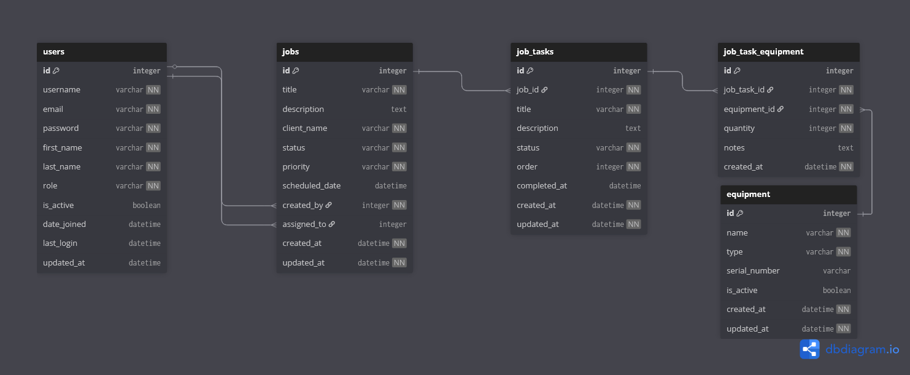

# JobOps - Internal Operations Management System

A lightweight Django REST API system where internal teams (Sales, Technicians, Admins) manage and track operations through job flows, multi-step tasks, and linked equipment. The system focuses on job lifecycle modeling with clear role-based access control.

## Features

### Core Functionality
- **User Authentication & Role-Based Access**: JWT-based authentication with three distinct roles
- **Job Management**: Complete job lifecycle from creation to completion
- **Task Management**: Ordered, multi-step tasks with equipment requirements
- **Equipment Catalog**: Global equipment management with task assignments
- **Technician Dashboard**: Specialized interface for field technicians

### Role-Based Permissions
- **Admin**: Full system access - user management, job oversight
- **Sales Agent**: Job and task creation, equipment management
- **Technician**: Dashboard access, status updates for assigned work only

## Tech Stack

- **Backend**: Django 5.2.6 + Django REST Framework
- **Authentication**: JWT (SimpleJWT)
- **Documentation**: drf-spectacular (Swagger/OpenAPI)
- **Database**: PostgreSQL (production ready)

## Quick Start

### 1. Clone and Setup
```bash
git clone <repository-url>
cd JobOps
```

### 2. Create Virtual Environment
```bash
python -m venv .venv
.venv\Scripts\activate  # Windows
# or
source .venv/bin/activate  # macOS/Linux
```

### 3. Install Dependencies
```bash
pip install -r requirements.txt
```

### 4. Database Setup
```bash
py manage.py makemigrations
py manage.py migrate
```

### 5. Create Admin User
```bash
py manage.py createsuperuser
```

### 6. Run Development Server
```bash
py manage.py runserver
```

The API will be available at: `http://localhost:8000/`

## ER Diagram 



## API Documentation

### Swagger UI
Access the interactive API documentation at:
```
http://localhost:8000/api/docs/
```

## API Endpoints

### Authentication
```
POST /api/token/          # Get JWT token
POST /api/token/refresh/  # Refresh JWT token
```

### User Management (Admin Only)
```
GET    /api/users/        # List all users
POST   /api/users/        # Create new user
GET    /api/users/{id}/   # Get user details
PUT    /api/users/{id}/   # Update user
DELETE /api/users/{id}/   # Delete user
GET    /api/profile/      # Get current user profile
```

### Job Management (Admin/Sales Only)
```
GET    /api/jobs/         # List all jobs
POST   /api/jobs/         # Create new job
GET    /api/jobs/{id}/    # Get job details
PUT    /api/jobs/{id}/    # Update job
DELETE /api/jobs/{id}/    # Delete job
```

### Task Management (Admin/Sales Only)
```
GET    /api/tasks/        # List all tasks
POST   /api/tasks/        # Create new task
GET    /api/tasks/{id}/   # Get task details
PUT    /api/tasks/{id}/   # Update task
DELETE /api/tasks/{id}/   # Delete task
```

### Equipment Management (Admin/Sales Only)
```
GET    /api/equipment/        # List all equipment
POST   /api/equipment/        # Add new equipment
GET    /api/equipment/{id}/   # Get equipment details
PUT    /api/equipment/{id}/   # Update equipment
DELETE /api/equipment/{id}/   # Delete equipment
```

### Technician Dashboard (Technicians Only)
```
GET   /api/technician-dashboard/                              # Get dashboard view
PATCH /api/technician-dashboard/task/{task_id}/update-status/ # Update task status
PATCH /api/technician-dashboard/job/{job_id}/update-status/   # Update job status
```

## Data Models

### User
- Extends Django's AbstractUser
- Roles: `ADMIN`, `TECHNICIAN`, `SALES_AGENT`
- Required fields: username, email, first_name, last_name

### Job
- Fields: title, description, client_name, status, priority, scheduled_date
- Status: `PENDING`, `IN_PROGRESS`, `COMPLETED`, `CANCELLED`
- Priority: `LOW`, `MEDIUM`, `HIGH`, `URGENT`
- Relationships: created_by (User), assigned_to (Technician)

### JobTask
- Fields: title, description, order, status, completed_at
- Status: `NOT_STARTED`, `IN_PROGRESS`, `COMPLETED`
- Relationships: job (Job), equipment (many-to-many)

### Equipment
- Fields: name, eq_type, serial_number, is_active
- Can be assigned to multiple tasks with quantity and notes

## Business Rules

### Job Lifecycle
1. Jobs can only be created by Admin or Sales Agent
2. Jobs must be assigned to a Technician
3. Jobs cannot be marked "COMPLETED" until all tasks are completed
4. Only assigned Technicians can update job progress

### Task Management
1. Tasks are ordered within jobs (step 1, 2, 3...)
2. Tasks can have required equipment with quantities
3. Technicians can only update status of tasks in their assigned jobs
4. Completing a task auto-sets the `completed_at` timestamp

### Equipment Management
1. Global equipment catalog managed by Admin/Sales
2. Equipment can be assigned to multiple tasks
3. Equipment in use cannot be deleted (RESTRICT foreign key)

## Development Setup

### Database Management
```bash
# Make migrations after model changes
py manage.py makemigrations

# Apply migrations
py manage.py migrate

# Create admin user
py manage.py createsuperuser

# Access Django admin
# http://localhost:8000/admin/
```

> [!IMPORTANT]
>### Testing Users
Create test users for each role:

```python
# In Django shell: py manage.py shell
from jobs.models import User

# Create admin
admin = User.objects.create_user(
    username='admin', 
    email='admin@jobops.com',
    first_name='System',
    last_name='Admin',
    role='ADMIN'
)
admin.set_password('admin123')
admin.save()

# Create sales agent
sales = User.objects.create_user(
    username='sales', 
    email='sales@jobops.com',
    first_name='John',
    last_name='Sales',
    role='SALES_AGENT'
)
sales.set_password('sales123')
sales.save()

# Create technician
tech = User.objects.create_user(
    username='tech', 
    email='tech@jobops.com',
    first_name='Jane',
    last_name='Tech',
    role='TECHNICIAN'
)
tech.set_password('tech123')
tech.save()
```

## Key Design Decisions

### Role-Based Architecture
- Clean separation between management (Admin/Sales) and execution (Technician)
- Technicians have dedicated dashboard endpoints instead of general CRUD access
- Prevents data exposure across different user types

### Job Lifecycle Management
- Enforced business rules at the API level
- Cannot complete jobs with incomplete tasks
- Automatic timestamp management

### Equipment Integration
- Many-to-many relationship allows equipment reuse
- Quantity and notes per assignment
- Prevents deletion of equipment in active use

## Security Features

- JWT-based authentication
- Role-based permission classes
- Object-level permissions for assigned work
- Anonymous user safety checks for schema generation

## API Design Principles

- RESTful endpoints with standard HTTP methods
- Consistent response formats with clear messages
- Comprehensive error handling with helpful messages
- Role-appropriate data filtering
- Professional OpenAPI documentation
